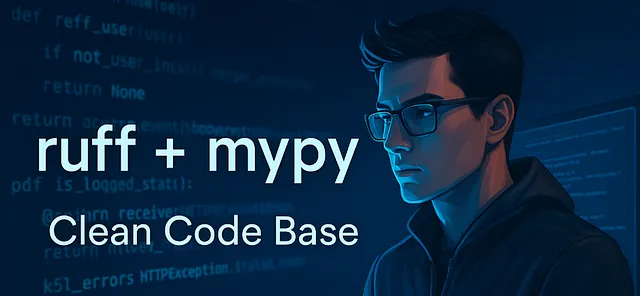

# Template: Python with Ruff and MyPy 



A modern Python project template pre-configured with Ruff (for linting and formatting) and MyPy (for static type checking).
This setup uses pre-commit to ensure code quality before every commit.

You can find concepts and step-by-step instructions in the article in Medium:
* 🔗 [How to: Automate a clean code base with Ruff and Mypy.](https://medium.com/@fernando.peres/how-to-automate-a-clean-code-base-with-ruff-and-mypy-ff7d9fa51e86) 


🚀 Features:
- **Ruff**: Blazing-fast linter and formatter
- **MyPy**: Static type checking for Python
- **pre-commit**: Automated checks before every commit
- **Easy setup**: Fast environment provisioning with `uv`

---

## 1. Installation

Step 1: Install dependencies

```bash
uv sync --all-groups
```

Step 2: Activate the virtual environment

```bash
source .venv/bin/activate
```

Step 3: Set up pre-commit hooks

```bash
pre-commit install  
```

## 2. Usage

Check pre-commit hook status

```bash
pre-commit run --all-files
``` 

Whenever you run:

```bash
git commit -m "<message>"
```
💡 When you run `git commit`, ***pre-commit hooks*** will automatically execute and checks  across the entire codebase by sing mypy and ruff.

**⚙️ Pre-commit Hook Behavior: Key Considerations**

* ⛔️ If any checks fail, the commit will be aborted. You must fix the issues before trying again.
To avoid losing work, commit frequently rather than making large, uncommitted changes.

* 🟢 Tools like Ruff and Mypy can automatically fix many common issues—such as formatting problems, unused imports, and basic type errors.

* 🟡 However, not all issues are auto-fixable. Some require manual intervention due to ambiguity or context-specific logic.

* 🔎 To confirm everything is clean after auto-fixes, run:  `pre-commit run --all-files`.

* 👨🏻‍💻 If issues persist, you’ll need to address them manually before retrying the commit.

```mermaid
flowchart LR
    A[git add . <br>git commit]
    B{Pass to hook <br>checks?}
    C[✅ <br>commited]
    D[⛔️ NOT<br>commited]
    E[Verify...]
    F{Issues<br>resolved?}
    G[Change<br>manually]
    H(pre-commit run --all-files)

    A-->B-- Yes --> C
    B -- No --> D --> E --> F -- yes--> A
    F -- No --> G --> F
    E -.- H

     classDef decision fill:#e0e0e0,stroke:#888,font-size:12px,color:#000000;
    classDef success fill:#c6f6c6,stroke:#2c662d,font-size:12px,color:#000000;
    classDef failure fill:#fbd3d3,stroke:#d9534f,font-size:12px,color:#000000;
    classDef standard fill:#f4f4f4,stroke:#aaa,font-size:12px,color:#000000;
    classDef note fill:#fffacc,stroke:#e6c200,font-size:12px,font-style:italic,color:#000000;

    class A,E,G,H standard
    class B,F decision
    class C success
    class D failure
    class H note

    %% Arrow (link) styles
    linkStyle default stroke:#999,stroke-width:1.5px;
```




## 3. Customization

* Configure Ruff and MyPy via `pyproject.toml`.
* Add or remove `pre-commit` hooks in `.pre-commit-config.yaml`.

Happy coding! 🚀
